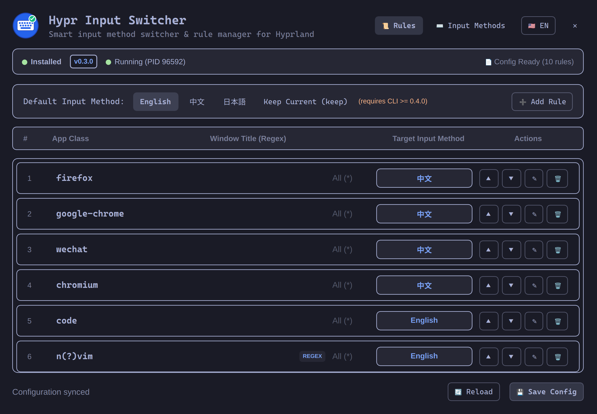

# Input Fusion — Omarchy 4.0 Overlay & Bar Widget

A live input-method bar widget and a control panel for **Omarchy 4.0+
(Quickshell)**. It shows the current fcitx5 Input Method and Rime Schema and
switches them straight from the bar, and it fuses two engines around that core:

- **`bloom`** — Rime schema / package management (which Schemas are enabled and
  installed). _Bridge: the bar panel and the Overlay's Bloom tab._
- **`hypr-input-switcher`** — automatic switching by window and layer rules.
  _Bridge: the Overlay below._

The whole plugin is **pure Quickshell & JavaScript** — no Python.



---

## ✨ Features

### Bar Widget (core)

- ⌨️ **Live Input Method / Schema status**: the bar shows the current fcitx5
  Input Method symbol, plus the Active Rime Schema while Rime is active
  (configurable).
- 🖱️ **Click-to-switch control panel**: left click opens a panel with an
  **Input Method** section and a unified **Schema** section; a click sets the
  Active Schema.
- 🅰️ **Direct Mode**: a dedicated row deactivates fcitx5, falling through to
  the bare keyboard layout (the `english` state).
- 🔄 **Optimistic, verified switching**: every switch is written over D-Bus and
  read back, since fcitx5 silently accepts invalid names.
- 🖥️ **Per-monitor**: each bar instance polls independently; no background
  service.

### Overlay — `hypr-input-switcher` rules

- 🪟 **Visual Rule Management**: view, add, edit, reorder, and remove Client
  Rules (window class, regex, title) and Layer Rules.
- 🎯 **Pure Native Window Picker**: click-to-pick any window (`slurp` +
  `hyprctl`) to auto-fill `class` and `title`.
- ⌨️ **Input Method Management**: display names, engine backends, and inline
  Rime schemas.
- ⚙️ **Default Input Method**: switch the fallback (`english`, `chinese`,
  `keep`, …).
- 💾 **Native Atomic YAML Sync**: bundled JavaScript YAML engine +
  `Quickshell.Io.FileView`.

> The `hypr-input-switcher` daemon keeps doing the automatic switching; the
> plugin only edits its configuration and shows its state.

### Bloom bridge

When the `bloom` binary is on `PATH`, the control panel grows a third section
and the Overlay a third tab. All reads go through `bloom --json …` (see ADR
0005); the plugin never parses Bloom's formatted text.

**Bar panel** — compact and click-driven:

- 🔁 **Schemas** — one **Schema List**: every Installed Schema (on disk), plus
  the Enabled set, plus the Schemas owned by Bloom packages, plus the Active
  Schema. It is Bloom-preferred with a Rime fallback (ADR 0006), so it works
  with or without `bloom`. Rows show each schema's own name, and a Component
  Schema is tagged when it is not enabled. Clicking a row sets the Active
  Schema; a checkbox (Bloom mode) enables/disables it in-process
  (`bloom enable` / `disable`), and a disabled schema stays listed.
- 🧩 **Installed Packages** — click a package to upgrade it.
- ⬆️ **Updates** — packages whose remote `HEAD` differs, refreshed on a
  five-minute cache and on demand, never on the one-second fcitx5 poll; click
  to upgrade.

**Overlay — Bloom tab** — the full management surface:

- Browse the **Registry** and Install/Remove packages.
- **Upgrade** or Remove installed packages.
- **Upgrade All** from the update list.

Heavy writes (install, upgrade, remove) open a floating terminal and run
`bloom` there, never inside the shell process; enable/disable are fast enough
to run in-process (ADR 0003). Without `bloom` installed the panel quietly
falls back to its two fcitx5 sections and the tab reports it as missing.

---

## 📂 Repository Structure

```text
.
├── manifest.json            # Omarchy 4.0 plugin manifest (id: icyleaf.input-fusion)
├── Widget.qml               # Bar widget (bar-widget entry point)
├── ControlPanel.qml         # Bar widget control panel
├── Backend.qml              # Owns every backend process; typed state + verbs
├── Overlay.qml              # Rule/Input Method configuration overlay
├── FcitxController.js       # fcitx5 / Rime D-Bus helpers (busctl --json)
├── BloomController.js       # bloom --json argv builders and parsers
├── i18n.js                  # Internationalization (EN / ZH)
├── yaml.js                  # Pure JavaScript YAML parser and serializer
├── test/                    # Node unit tests for the JS seams
├── LICENSE
├── README.md
├── CONTEXT.md               # Domain glossary
├── docs/adr/                # Architecture decisions
└── assets/
    └── logo.svg
```

---

## 🛠️ Requirements

- **Omarchy 4.0+** (`omarchy-shell` / Quickshell)
- **fcitx5** with the **Rime** addon (`org.fcitx.Fcitx5` on the session bus)
- **[hypr-input-switcher](https://github.com/icyleaf/hypr-input-switcher)**
  (`/usr/bin/hypr-input-switcher` or in `$PATH`) — for the Overlay's rule engine
- **[bloom](https://github.com/icyleaf/bloom)** _(optional)_ — for the
  read-only Bloom bridge; needs a build with the `--json` flag
- **[slurp](https://github.com/emersion/slurp)** _(optional)_ — interactive
  window picking

---

## 🚀 Installation

### Via the Omarchy Plugin Manager (Git Remote)

```bash
omarchy plugin add https://github.com/icyleaf/omarchy-input-fusion --enable
```

### Manual

```bash
mkdir -p ~/.config/omarchy/plugins/icyleaf.input-fusion
cp -r ./* ~/.config/omarchy/plugins/icyleaf.input-fusion/

omarchy-shell shell rescanPlugins
omarchy plugin enable icyleaf.input-fusion
```

---

## 🧑💻 Local Development

The repo ships [`mise`](https://mise.jdx.dev/) tasks (`.mise.toml`), mirroring
the `omarchy-bitwarden` plugin's `dev-*` workflow. The installed plugin is a
git clone at `~/.config/omarchy/plugins/icyleaf.input-fusion`; these tasks push
your checkout into it and restart the shell.

```bash
mise run test          # Node unit tests for the JS seams
mise run version       # plugin version from manifest.json

# Deploy committed work from this checkout (no GitHub push needed): the
# installed clone fetches this branch from here and hard-resets to it.
mise run dev-deploy

# Fast iteration including uncommitted changes (rsync; leaves the installed
# clone dirty, so prefer dev-deploy for the clean tracked path).
mise run dev-sync
mise run dev-restart-omarchy
```

Detection of the optional `bloom` binary is `command -v bloom` under the
shell's `PATH`; if `~/.local/bin` is on the shell's path (it is on Omarchy),
the Bloom section appears automatically.

---

## ⌨️ Usage & Keybinding

### Toggle the Overlay

```bash
omarchy-shell shell toggle icyleaf.input-fusion
```

```lua
# Hyprland keybinding (e.g. ~/.config/hypr/bindings.conf)
o.bind("SUPER + ALT + P", "Input Fusion", function()
  hl.dispatch(hl.dsp.exec_cmd("omarchy-shell shell toggle icyleaf.input-fusion"))
end)
```

### Bar Widget

```bash
omarchy bar put icyleaf.input-fusion
```

- **Left click** opens the control panel: the **Input Method** section lists the
  current group's members plus an _English (Direct)_ row; the **Rime Schema**
  section lists every enabled Schema.
- **Middle click** opens the Overlay.
- Selecting a row closes the panel and applies the switch.
- Settings (per bar entry in `shell.json`): `showSchemaOnBar` (default `true`),
  `autoSwitchToRime` (default `true`).

---

## 📄 License

MIT
